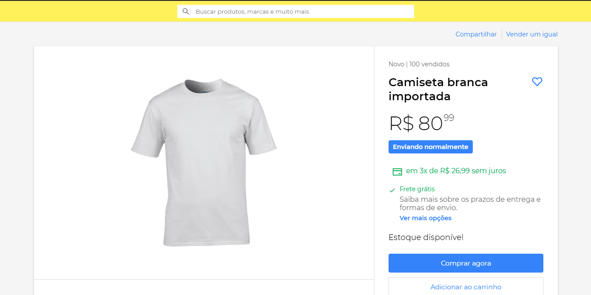
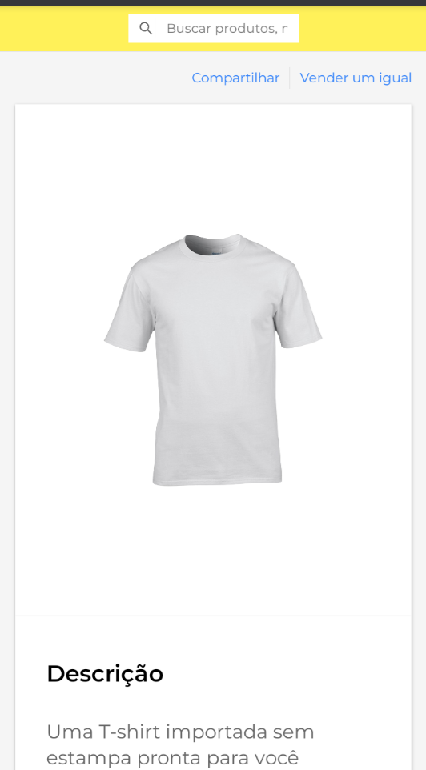

# Mercado Livre Clone
  Clone da vitrine do Mercado Livre feito com React.
  Projeto resultado do UI Clone da Rocketseat.


## Technologies
* React
* React Icons
* Typescript
* styled-components

## How to run

```
# Clone repository

git clone https://github.com/r3nanp/mercadolivre-clone.git
```

```
# At the root of the project, run:

yarn
```

```
# Run app

yarn start or npm start
```

### Link
[Website](https://r3nanp-mercadolivre-clone.netlify.app/)

### Screenshots
  
  

